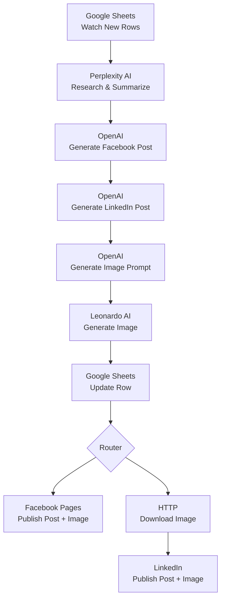

# AI-Powered Social Media Automation with Make.com

An end-to-end AI-powered social media automation workflow built using Make.com, Google Sheets, Perplexity AI, OpenAI, Leonardo AI, Facebook Pages, and LinkedIn.

## Overview

This project automates the process of researching computer science and technology topics, generating platform-specific social media content, creating AI-generated images, and publishing posts to Facebook and LinkedIn.

Google Sheets acts as the control panel for the automation. A new topic added to the sheet triggers the workflow.

## Workflow

1. Google Sheets detects a new topic.
2. Perplexity AI researches and summarizes the topic.
3. OpenAI generates a Facebook post.
4. OpenAI generates a LinkedIn post.
5. OpenAI creates an image-generation prompt.
6. Leonardo AI generates a social media image.
7. Google Sheets is updated with the generated content and image URL.
8. A Make.com router separates the publishing workflow.
9. Facebook Pages publishes the Facebook post with the generated image.
10. Make's HTTP module downloads the generated image.
11. LinkedIn publishes the post and image to the user's profile.

## Architecture

## Technologies Used

- Make.com
- Google Sheets
- Perplexity AI
- OpenAI
- Leonardo AI
- Facebook Pages
- LinkedIn
- HTTP

## Google Sheets Structure

| Column | Purpose |
|---|---|
| Status | Tracks whether the row is ready or completed |
| Topic or Text | Topic used to generate content |
| URL | Optional source URL |
| Summary | Research generated by Perplexity AI |
| Facebook Post | Facebook-specific AI content |
| LinkedIn Post | LinkedIn-specific AI content |
| Instagram Post | Reserved for future expansion |
| Image Prompt | Prompt created for image generation |
| Image URL | URL of the Leonardo-generated image |

## Key Features

- Automated technology-topic research
- Platform-specific AI content generation
- AI image prompt generation
- Automated image generation
- Google Sheets workflow tracking
- Automated Facebook publishing
- Automated LinkedIn publishing
- Modular architecture for adding additional platforms

## Future Improvements

- Instagram automation
- Scheduled publishing
- Human approval before publishing
- Error handling and retries
- Social media analytics
- Multiple image styles
- Duplicate-content prevention

## Security

API keys and authentication credentials are not stored in this repository.

All credentials must be configured directly through Make.com connections.
